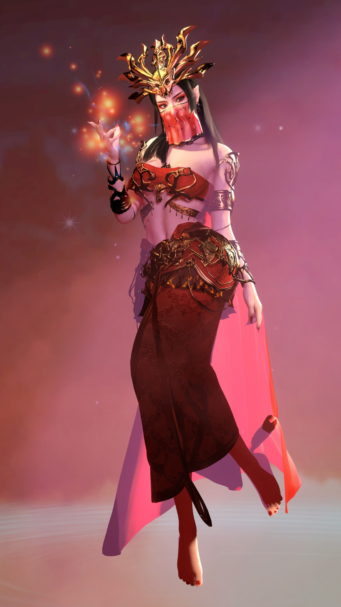

</p>

<h1 align="center">🛡️ <b>0xSh0gunX</b></h1>
<h3 align="center">Cybersecurity | Blue Team | Arch Linux</h3>


```sh
oxsh0gunX@cs30: ~/my_readme (main⚡)$ neofetch
```

   

```csharp
My Profile
-------------------------------
Host Name: EndeavourOS x86_64
User name: oxsh0gunX
Who am i: BCA Graduate
DE / WM : Hyprland 0.52.1 (Wayland)
config  : Cyber Security
Location: Inazuma,Main City
skills  : Kiddy
my wepon: i5,3 3200g
```
<p >
  
  
  
  
  
  
  
  
  
  


</p>


<div>
<br>
<br>
<br>
<br>
  
---


---

## 📊 GitHub Stats
<p align="center">

<p align="center">
  
  <p align="center">
  
</p>

</p>

---


---

## 🌐 Connect With Me
<p align="center">
  <a href="https://t.me/oxsh0gunX"></a>
  <a href="mailto:safvanmbn@gmail.com"></a>
  <a href="https://github.com/oxsh0gunX"></a>
  <a href="https://www.linkedin.com/in/muhammed-safvan-b4629b27a/"></a>
</p>

---

<p align="center">
  <i>“Defense is the art of understanding the attack.”</i><br>
  <b>Stay Anonymous. Stay Secure.</b> 🕶️
</p>

